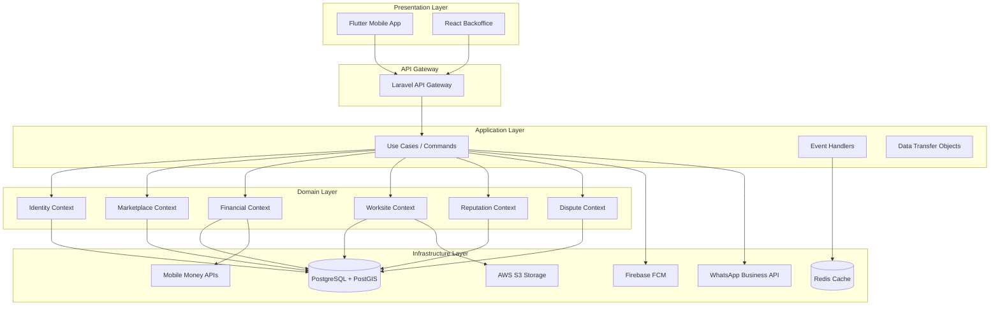
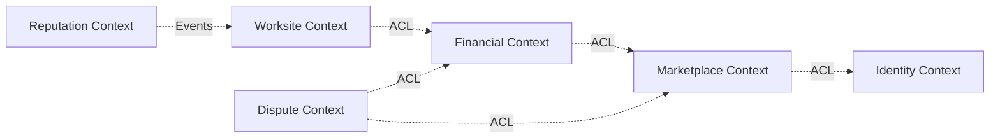

# Design Document: ProSartisan Platform Implementation

## Overview

The ProSartisan platform is a marketplace connecting clients with artisans in Côte d'Ivoire. The system implements Domain-Driven Design (DDD) with 6 bounded contexts, each responsible for a specific business capability. The architecture follows a layered approach with clear separation between domain logic, application services, infrastructure, and presentation layers.

**Core Technologies:**
- Backend: Laravel 10+ (PHP 8.2+) with DDD architecture
- Mobile: Flutter 3.x for iOS and Android
- Backoffice: React.js with TypeScript
- Database: PostgreSQL 15+ with PostGIS extension
- Cache: Redis for session management and caching
- Queue: Laravel Queue with Redis driver for async processing
- Storage: AWS S3 or local storage for photos and documents

**Key Design Principles:**
1. **Bounded Contexts**: Each context is autonomous with its own domain model
2. **Event-Driven**: Contexts communicate via domain events
3. **CQRS Pattern**: Separate read and write models for complex queries
4. **Anti-Corruption Layer**: Protect domain models from external dependencies
5. **Saga Pattern**: Orchestrate long-running business processes
6. **Immutable Audit Trail**: All financial transactions are logged permanently

## Architecture

### High-Level Architecture Diagram




### Bounded Context Relationships



**Context Mapping:**
- **Anti-Corruption Layer (ACL)**: Marketplace, Financial, Worksite, and Dispute contexts access other contexts through ACLs to prevent coupling
- **Event-Driven**: Reputation context subscribes to Worksite events for score calculation
- **Shared Kernel**: Common value objects (Montant, GPS_Coordinates, DeviseXOF) are shared across contexts

## Components and Interfaces

### 1. Identity Management Context

**Purpose**: Handle user registration, authentication, and KYC verification.

**Domain Entities:**
```php
// Domain/Identity/Entities/User.php
class User {
    private UserId $id;
    private Email $email;
    private HashedPassword $password;
    private UserType $type; // CLIENT, ARTISAN, FOURNISSEUR, REFERENT_ZONE, ADMIN
    private AccountStatus $status; // PENDING, ACTIVE, SUSPENDED
    private ?KYCDocuments $kycDocuments;
    private DateTime $createdAt;
    
    public function verifyKYC(KYCDocuments $documents): void;
    public function suspend(string $reason): void;
    public function activate(): void;
}

class Artisan extends User {
    private TradeCategory $category;
    private PhoneNumber $phoneNumber;
    private GPS_Coordinates $location;
    private bool $isKYCVerified;
    
    public function canAcceptMissions(): bool;
}

class Client extends User {
    private PhoneNumber $phoneNumber;
    private PaymentMethod $preferredPaymentMethod;
}

class Fournisseur extends User {
    private string $businessName;
    private GPS_Coordinates $shopLocation;
    private PhoneNumber $phoneNumber;
}
```

**Value Objects:**
```php
class KYCDocuments {
    private string $idType; // CNI or PASSPORT
    private string $idNumber;
    private string $idDocumentUrl;
    private string $selfieUrl;
    private DateTime $submittedAt;
}

class GPS_Coordinates {
    private float $latitude;
    private float $longitude;
    private float $accuracy; // in meters
    
    public function distanceTo(GPS_Coordinates $other): float;
    public function blur(int $radiusMeters): GPS_Coordinates;
}
```

**Domain Services:**
```php
interface KYCVerificationService {
    public function verifyDocuments(KYCDocuments $documents): KYCVerificationResult;
}

interface AuthenticationService {
    public function authenticate(Email $email, string $password): AuthToken;
    public function generateOTP(PhoneNumber $phone): OTP;
    public function verifyOTP(PhoneNumber $phone, string $code): bool;
}
```

**Repository Interface:**
```php
interface UserRepository {
    public function save(User $user): void;
    public function findById(UserId $id): ?User;
    public function findByEmail(Email $email): ?User;
    public function findArtisansNearLocation(GPS_Coordinates $location, float $radiusKm): array;
}
```

**Domain Events:**
```php
class UserRegistered {
    public UserId $userId;
    public UserType $userType;
    public DateTime $occurredAt;
}

class KYCVerified {
    public UserId $userId;
    public DateTime $verifiedAt;
}

class AccountSuspended {
    public UserId $userId;
    public string $reason;
    public DateTime $occurredAt;
}
```


### 2. Marketplace Context

**Purpose**: Enable artisan discovery, mission creation, and quote management.

**Domain Entities:**
```php
// Domain/Marketplace/Entities/Mission.php
class Mission {
    private MissionId $id;
    private UserId $clientId;
    private string $description;
    private TradeCategory $category;
    private GPS_Coordinates $location;
    private MoneyAmount $budgetMin;
    private MoneyAmount $budgetMax;
    private MissionStatus $status; // OPEN, QUOTED, ACCEPTED, CANCELLED
    private array $quotes; // Collection of Devis
    private DateTime $createdAt;
    
    public function addQuote(Devis $quote): void;
    public function acceptQuote(DevisId $quoteId): void;
    public function cancel(): void;
    public function canReceiveMoreQuotes(): bool; // Max 3 quotes
}

class Devis {
    private DevisId $id;
    private MissionId $missionId;
    private UserId $artisanId;
    private MoneyAmount $totalAmount;
    private MoneyAmount $materialsAmount;
    private MoneyAmount $laborAmount;
    private array $lineItems; // Collection of DevisLine
    private DevisStatus $status; // PENDING, ACCEPTED, REJECTED
    private DateTime $createdAt;
    private ?DateTime $expiresAt;
    
    public function accept(): void;
    public function reject(): void;
    public function isExpired(): bool;
}

class DevisLine {
    private string $description;
    private int $quantity;
    private MoneyAmount $unitPrice;
    private DevisLineType $type; // MATERIAL or LABOR
    
    public function getTotal(): MoneyAmount;
}
```

**Value Objects:**
```php
class TradeCategory {
    private string $value; // PLUMBER, ELECTRICIAN, MASON
    
    public static function fromString(string $value): self;
    public function toString(): string;
}

class MissionStatus {
    private string $value;
    
    public static function open(): self;
    public static function quoted(): self;
    public static function accepted(): self;
    public static function cancelled(): self;
}
```

**Domain Services:**
```php
interface ArtisanSearchService {
    public function searchNearby(
        GPS_Coordinates $location,
        TradeCategory $category,
        float $radiusKm
    ): array;
    
    public function applyProximityBoost(array $artisans, GPS_Coordinates $clientLocation): array;
}

interface LocationPrivacyService {
    public function blurCoordinates(GPS_Coordinates $coords, int $radiusMeters): GPS_Coordinates;
    public function revealExactLocation(MissionId $missionId, UserId $artisanId): GPS_Coordinates;
}

interface MapClusteringService {
    public function clusterArtisans(array $artisans, int $zoomLevel): array;
}
```

**Repository Interface:**
```php
interface MissionRepository {
    public function save(Mission $mission): void;
    public function findById(MissionId $id): ?Mission;
    public function findOpenMissionsNearLocation(GPS_Coordinates $location, float $radiusKm): array;
    public function findByClientId(UserId $clientId): array;
}

interface DevisRepository {
    public function save(Devis $devis): void;
    public function findById(DevisId $id): ?Devis;
    public function findByMissionId(MissionId $missionId): array;
    public function findByArtisanId(UserId $artisanId): array;
}
```

**Domain Events:**
```php
class MissionCreated {
    public MissionId $missionId;
    public UserId $clientId;
    public GPS_Coordinates $location;
    public TradeCategory $category;
    public DateTime $occurredAt;
}

class QuoteSubmitted {
    public DevisId $devisId;
    public MissionId $missionId;
    public UserId $artisanId;
    public MoneyAmount $totalAmount;
    public DateTime $occurredAt;
}

class QuoteAccepted {
    public DevisId $devisId;
    public MissionId $missionId;
    public UserId $clientId;
    public UserId $artisanId;
    public MoneyAmount $totalAmount;
    public DateTime $occurredAt;
}
```


### 3. Financial Transactions Context

**Purpose**: Manage escrow accounts, material tokens, and payment processing.

**Domain Entities:**
```php
// Domain/Financial/Entities/Sequestre.php
class Sequestre {
    private SequestreId $id;
    private MissionId $missionId;
    private UserId $clientId;
    private UserId $artisanId;
    private MoneyAmount $totalAmount;
    private MoneyAmount $materialsAmount; // 65%
    private MoneyAmount $laborAmount; // 35%
    private MoneyAmount $materialsReleased;
    private MoneyAmount $laborReleased;
    private SequestreStatus $status; // BLOCKED, PARTIAL, RELEASED, REFUNDED
    private DateTime $createdAt;
    
    public function fragment(): void; // Split 65/35
    public function releaseMaterials(MoneyAmount $amount): void;
    public function releaseLabor(MoneyAmount $amount): void;
    public function refund(MoneyAmount $amount): void;
    public function getRemainingMaterials(): MoneyAmount;
    public function getRemainingLabor(): MoneyAmount;
}

class JetonMateriel {
    private JetonId $id;
    private SequestreId $sequestreId;
    private UserId $artisanId;
    private string $code; // Format: PA-XXXX
    private MoneyAmount $totalAmount;
    private MoneyAmount $usedAmount;
    private array $authorizedSuppliers; // List of FournisseurId
    private JetonStatus $status; // ACTIVE, PARTIALLY_USED, FULLY_USED, EXPIRED
    private DateTime $createdAt;
    private DateTime $expiresAt; // 7 days from creation
    
    public function validate(UserId $fournisseurId, MoneyAmount $amount, GPS_Coordinates $artisanLocation, GPS_Coordinates $supplierLocation): void;
    public function isExpired(): bool;
    public function getRemainingAmount(): MoneyAmount;
}

class Transaction {
    private TransactionId $id;
    private UserId $fromUserId;
    private UserId $toUserId;
    private MoneyAmount $amount;
    private TransactionType $type; // ESCROW_BLOCK, MATERIAL_RELEASE, LABOR_RELEASE, REFUND
    private TransactionStatus $status; // PENDING, COMPLETED, FAILED
    private ?string $mobileMoneyReference;
    private DateTime $createdAt;
    private ?DateTime $completedAt;
    
    public function complete(string $reference): void;
    public function fail(string $reason): void;
}
```

**Value Objects:**
```php
class MoneyAmount {
    private int $amountInCentimes; // Store in smallest unit (centimes)
    private Currency $currency; // Always XOF
    
    public function add(MoneyAmount $other): MoneyAmount;
    public function subtract(MoneyAmount $other): MoneyAmount;
    public function multiply(float $factor): MoneyAmount;
    public function percentage(int $percent): MoneyAmount;
    public function toFloat(): float;
    public function format(): string; // "1 000 000 FCFA"
}

class JetonCode {
    private string $value; // PA-XXXX format
    
    public static function generate(): self;
    public function toString(): string;
}
```

**Domain Services:**
```php
interface EscrowFragmentationService {
    public function calculateFragmentation(MoneyAmount $total): array; // Returns [materials: 65%, labor: 35%]
}

interface MobileMoneyGateway {
    public function blockFunds(UserId $userId, MoneyAmount $amount): TransactionReference;
    public function transferFunds(UserId $fromUserId, UserId $toUserId, MoneyAmount $amount): TransactionReference;
    public function refundFunds(UserId $userId, MoneyAmount $amount): TransactionReference;
    public function checkTransactionStatus(TransactionReference $ref): TransactionStatus;
}

interface AntiFraudService {
    public function verifyProximity(GPS_Coordinates $location1, GPS_Coordinates $location2, float $maxDistanceMeters): bool;
    public function detectSuspiciousActivity(UserId $userId): bool;
}

interface JetonFactory {
    public function createJeton(Sequestre $sequestre, Artisan $artisan, array $nearbySuppliers): JetonMateriel;
}
```

**Repository Interface:**
```php
interface SequestreRepository {
    public function save(Sequestre $sequestre): void;
    public function findById(SequestreId $id): ?Sequestre;
    public function findByMissionId(MissionId $missionId): ?Sequestre;
}

interface JetonRepository {
    public function save(JetonMateriel $jeton): void;
    public function findById(JetonId $id): ?JetonMateriel;
    public function findByCode(string $code): ?JetonMateriel;
    public function findActiveByArtisan(UserId $artisanId): array;
}

interface TransactionRepository {
    public function save(Transaction $transaction): void;
    public function findById(TransactionId $id): ?Transaction;
    public function findByUserId(UserId $userId): array;
}
```

**Domain Events:**
```php
class FundsBlocked {
    public SequestreId $sequestreId;
    public MissionId $missionId;
    public MoneyAmount $totalAmount;
    public DateTime $occurredAt;
}

class EscrowFragmented {
    public SequestreId $sequestreId;
    public MoneyAmount $materialsAmount;
    public MoneyAmount $laborAmount;
    public DateTime $occurredAt;
}

class JetonGenerated {
    public JetonId $jetonId;
    public UserId $artisanId;
    public string $code;
    public MoneyAmount $amount;
    public DateTime $expiresAt;
    public DateTime $occurredAt;
}

class JetonValidated {
    public JetonId $jetonId;
    public UserId $fournisseurId;
    public MoneyAmount $amountUsed;
    public GPS_Coordinates $validationLocation;
    public DateTime $occurredAt;
}

class LaborPaymentReleased {
    public SequestreId $sequestreId;
    public UserId $artisanId;
    public MoneyAmount $amount;
    public DateTime $occurredAt;
}
```


### 4. Worksite Management Context

**Purpose**: Track project progress, manage milestones, and validate deliverables.

**Domain Entities:**
```php
// Domain/Worksite/Entities/Chantier.php
class Chantier {
    private ChantierId $id;
    private MissionId $missionId;
    private UserId $clientId;
    private UserId $artisanId;
    private array $milestones; // Collection of Jalon
    private ChantierStatus $status; // IN_PROGRESS, COMPLETED, DISPUTED
    private DateTime $startedAt;
    private ?DateTime $completedAt;
    
    public function addMilestone(Jalon $milestone): void;
    public function start(): void;
    public function complete(): void;
    public function getAllMilestones(): array;
    public function getPendingMilestones(): array;
}

class Jalon {
    private JalonId $id;
    private ChantierId $chantierId;
    private string $description;
    private MoneyAmount $laborAmount;
    private int $sequenceNumber;
    private JalonStatus $status; // PENDING, SUBMITTED, VALIDATED, CONTESTED
    private ?ProofOfDelivery $proof;
    private DateTime $createdAt;
    private ?DateTime $submittedAt;
    private ?DateTime $validatedAt;
    private ?DateTime $autoValidationDeadline; // 48h after submission
    
    public function submitProof(ProofOfDelivery $proof): void;
    public function validate(): void;
    public function contest(string $reason): void;
    public function autoValidate(): void;
    public function isAutoValidationDue(): bool;
}

class ProofOfDelivery {
    private string $photoUrl;
    private GPS_Coordinates $location;
    private DateTime $capturedAt;
    private array $exifData;
    
    public function verifyIntegrity(): bool;
}
```

**Value Objects:**
```php
class ChantierStatus {
    private string $value;
    
    public static function inProgress(): self;
    public static function completed(): self;
    public static function disputed(): self;
}

class JalonStatus {
    private string $value;
    
    public static function pending(): self;
    public static function submitted(): self;
    public static function validated(): self;
    public static function contested(): self;
}
```

**Domain Services:**
```php
interface MilestoneValidationService {
    public function validateProof(ProofOfDelivery $proof): ValidationResult;
    public function generateOTP(PhoneNumber $clientPhone): OTP;
    public function verifyOTP(PhoneNumber $phone, string $code): bool;
}

interface PhotoVerificationService {
    public function extractGPSFromExif(string $photoUrl): ?GPS_Coordinates;
    public function verifyTimestamp(DateTime $capturedAt): bool;
    public function verifyPhotoIntegrity(string $photoUrl): bool;
}

interface AutoValidationService {
    public function scheduleAutoValidation(JalonId $jalonId, DateTime $deadline): void;
    public function processAutoValidations(): void; // Cron job
}
```

**Repository Interface:**
```php
interface ChantierRepository {
    public function save(Chantier $chantier): void;
    public function findById(ChantierId $id): ?Chantier;
    public function findByMissionId(MissionId $missionId): ?Chantier;
    public function findActiveByArtisan(UserId $artisanId): array;
}

interface JalonRepository {
    public function save(Jalon $jalon): void;
    public function findById(JalonId $id): ?Jalon;
    public function findByChantierId(ChantierId $chantierId): array;
    public function findPendingAutoValidations(): array;
}
```

**Domain Events:**
```php
class ChantierStarted {
    public ChantierId $chantierId;
    public MissionId $missionId;
    public UserId $artisanId;
    public DateTime $occurredAt;
}

class MilestoneProofSubmitted {
    public JalonId $jalonId;
    public ChantierId $chantierId;
    public UserId $artisanId;
    public string $photoUrl;
    public GPS_Coordinates $location;
    public DateTime $occurredAt;
}

class MilestoneValidated {
    public JalonId $jalonId;
    public ChantierId $chantierId;
    public UserId $clientId;
    public MoneyAmount $laborAmountToRelease;
    public bool $wasAutoValidated;
    public DateTime $occurredAt;
}

class ChantierCompleted {
    public ChantierId $chantierId;
    public MissionId $missionId;
    public UserId $artisanId;
    public DateTime $occurredAt;
}
```


### 5. Reputation Management Context

**Purpose**: Calculate and maintain artisan reputation scores (N'Zassa).

**Domain Entities:**
```php
// Domain/Reputation/Entities/ReputationProfile.php
class ReputationProfile {
    private ProfileId $id;
    private UserId $artisanId;
    private NZassaScore $currentScore;
    private array $scoreHistory; // Collection of ScoreSnapshot
    private ReputationMetrics $metrics;
    private DateTime $lastCalculatedAt;
    
    public function recalculateScore(ReputationMetrics $newMetrics): void;
    public function getScoreHistory(): array;
    public function isEligibleForMicroCredit(): bool; // Score > 700
}

class ScoreSnapshot {
    private NZassaScore $score;
    private string $reason;
    private DateTime $recordedAt;
}

class ReputationMetrics {
    private float $reliabilityScore; // 40% weight
    private float $integrityScore; // 30% weight
    private float $qualityScore; // 20% weight
    private float $reactivityScore; // 10% weight
    private int $completedProjects;
    private int $acceptedProjects;
    private float $averageRating;
    private float $averageResponseTimeHours;
    private int $fraudAttempts;
}
```

**Value Objects:**
```php
class NZassaScore {
    private int $value; // 0-100
    
    public function __construct(int $value) {
        if ($value < 0 || $value > 100) {
            throw new InvalidScoreException();
        }
        $this->value = $value;
    }
    
    public function getValue(): int;
    public function isEligibleForCredit(): bool; // > 700
}
```

**Domain Services:**
```php
interface ScoreCalculationService {
    public function calculateScore(ReputationMetrics $metrics): NZassaScore;
    public function calculateReliability(int $completed, int $accepted): float;
    public function calculateIntegrity(int $fraudAttempts): float;
    public function calculateQuality(float $averageRating): float;
    public function calculateReactivity(float $avgResponseHours): float;
}

interface MetricsAggregationService {
    public function aggregateMetrics(UserId $artisanId): ReputationMetrics;
    public function getCompletedProjectsCount(UserId $artisanId): int;
    public function getAcceptedProjectsCount(UserId $artisanId): int;
    public function getAverageRating(UserId $artisanId): float;
    public function getAverageResponseTime(UserId $artisanId): float;
    public function getFraudAttemptsCount(UserId $artisanId): int;
}
```

**Repository Interface:**
```php
interface ReputationRepository {
    public function save(ReputationProfile $profile): void;
    public function findByArtisanId(UserId $artisanId): ?ReputationProfile;
    public function findTopArtisans(int $limit): array;
}
```

**Domain Events:**
```php
class ScoreRecalculated {
    public UserId $artisanId;
    public NZassaScore $oldScore;
    public NZassaScore $newScore;
    public string $reason;
    public DateTime $occurredAt;
}

class MicroCreditEligibilityAchieved {
    public UserId $artisanId;
    public NZassaScore $score;
    public DateTime $occurredAt;
}
```

### 6. Dispute Resolution Context

**Purpose**: Handle conflicts between clients and artisans through mediation and arbitration.

**Domain Entities:**
```php
// Domain/Dispute/Entities/Litige.php
class Litige {
    private LitigeId $id;
    private MissionId $missionId;
    private UserId $reporterId;
    private UserId $defendantId;
    private DisputeType $type; // QUALITY, PAYMENT, DELAY, OTHER
    private string $description;
    private array $evidence; // URLs to photos/documents
    private DisputeStatus $status; // OPEN, IN_MEDIATION, IN_ARBITRATION, RESOLVED, CLOSED
    private ?Mediation $mediation;
    private ?Arbitration $arbitration;
    private DateTime $createdAt;
    private ?DateTime $resolvedAt;
    
    public function startMediation(UserId $mediatorId): void;
    public function escalateToArbitration(UserId $arbitratorId): void;
    public function resolve(Resolution $resolution): void;
}

class Mediation {
    private UserId $mediatorId;
    private array $communications; // Messages between parties
    private DateTime $startedAt;
    private ?DateTime $endedAt;
    
    public function addCommunication(string $message, UserId $senderId): void;
}

class Arbitration {
    private UserId $arbitratorId;
    private ArbitrationDecision $decision;
    private string $justification;
    private DateTime $renderedAt;
}

class ArbitrationDecision {
    private DecisionType $type; // REFUND_CLIENT, PAY_ARTISAN, PARTIAL_REFUND, FREEZE_FUNDS
    private ?MoneyAmount $amount;
}
```

**Value Objects:**
```php
class DisputeType {
    private string $value;
    
    public static function quality(): self;
    public static function payment(): self;
    public static function delay(): self;
    public static function other(): self;
}

class DisputeStatus {
    private string $value;
    
    public static function open(): self;
    public static function inMediation(): self;
    public static function inArbitration(): self;
    public static function resolved(): self;
}
```

**Domain Services:**
```php
interface MediationService {
    public function assignMediator(Litige $litige): UserId;
    public function facilitateDialogue(LitigeId $litigeId): void;
}

interface ArbitrationService {
    public function renderDecision(Litige $litige): ArbitrationDecision;
    public function executeDecision(ArbitrationDecision $decision, SequestreId $sequestreId): void;
}
```

**Repository Interface:**
```php
interface LitigeRepository {
    public function save(Litige $litige): void;
    public function findById(LitigeId $id): ?Litige;
    public function findByMissionId(MissionId $missionId): array;
    public function findOpenDisputes(): array;
}
```

**Domain Events:**
```php
class DisputeReported {
    public LitigeId $litigeId;
    public MissionId $missionId;
    public UserId $reporterId;
    public DisputeType $type;
    public DateTime $occurredAt;
}

class MediationStarted {
    public LitigeId $litigeId;
    public UserId $mediatorId;
    public DateTime $occurredAt;
}

class ArbitrationRendered {
    public LitigeId $litigeId;
    public ArbitrationDecision $decision;
    public DateTime $occurredAt;
}
```


## Data Models

### Database Schema Overview

The system uses PostgreSQL with PostGIS extension for geospatial queries. Each bounded context has its own set of tables with clear ownership boundaries.

### Identity Context Tables

```sql
-- users table (polymorphic for all user types)
CREATE TABLE users (
    id UUID PRIMARY KEY DEFAULT gen_random_uuid(),
    email VARCHAR(255) UNIQUE NOT NULL,
    password_hash VARCHAR(255) NOT NULL,
    user_type VARCHAR(50) NOT NULL, -- CLIENT, ARTISAN, FOURNISSEUR, REFERENT_ZONE, ADMIN
    account_status VARCHAR(50) NOT NULL DEFAULT 'PENDING',
    phone_number VARCHAR(20),
    created_at TIMESTAMP NOT NULL DEFAULT NOW(),
    updated_at TIMESTAMP NOT NULL DEFAULT NOW()
);

-- artisan_profiles table
CREATE TABLE artisan_profiles (
    id UUID PRIMARY KEY DEFAULT gen_random_uuid(),
    user_id UUID NOT NULL REFERENCES users(id) ON DELETE CASCADE,
    trade_category VARCHAR(50) NOT NULL,
    location GEOGRAPHY(POINT, 4326),
    is_kyc_verified BOOLEAN DEFAULT FALSE,
    kyc_documents JSONB,
    created_at TIMESTAMP NOT NULL DEFAULT NOW(),
    updated_at TIMESTAMP NOT NULL DEFAULT NOW()
);

-- fournisseur_profiles table
CREATE TABLE fournisseur_profiles (
    id UUID PRIMARY KEY DEFAULT gen_random_uuid(),
    user_id UUID NOT NULL REFERENCES users(id) ON DELETE CASCADE,
    business_name VARCHAR(255) NOT NULL,
    shop_location GEOGRAPHY(POINT, 4326),
    created_at TIMESTAMP NOT NULL DEFAULT NOW(),
    updated_at TIMESTAMP NOT NULL DEFAULT NOW()
);

-- kyc_verifications table
CREATE TABLE kyc_verifications (
    id UUID PRIMARY KEY DEFAULT gen_random_uuid(),
    user_id UUID NOT NULL REFERENCES users(id) ON DELETE CASCADE,
    id_type VARCHAR(50) NOT NULL,
    id_number VARCHAR(100) NOT NULL,
    id_document_url TEXT NOT NULL,
    selfie_url TEXT NOT NULL,
    verification_status VARCHAR(50) NOT NULL DEFAULT 'PENDING',
    verified_at TIMESTAMP,
    created_at TIMESTAMP NOT NULL DEFAULT NOW()
);

CREATE INDEX idx_users_email ON users(email);
CREATE INDEX idx_artisan_location ON artisan_profiles USING GIST(location);
CREATE INDEX idx_fournisseur_location ON fournisseur_profiles USING GIST(location);
```

### Marketplace Context Tables

```sql
-- missions table
CREATE TABLE missions (
    id UUID PRIMARY KEY DEFAULT gen_random_uuid(),
    client_id UUID NOT NULL REFERENCES users(id),
    description TEXT NOT NULL,
    trade_category VARCHAR(50) NOT NULL,
    location GEOGRAPHY(POINT, 4326) NOT NULL,
    budget_min_centimes BIGINT NOT NULL,
    budget_max_centimes BIGINT NOT NULL,
    status VARCHAR(50) NOT NULL DEFAULT 'OPEN',
    created_at TIMESTAMP NOT NULL DEFAULT NOW(),
    updated_at TIMESTAMP NOT NULL DEFAULT NOW()
);

-- devis (quotes) table
CREATE TABLE devis (
    id UUID PRIMARY KEY DEFAULT gen_random_uuid(),
    mission_id UUID NOT NULL REFERENCES missions(id) ON DELETE CASCADE,
    artisan_id UUID NOT NULL REFERENCES users(id),
    total_amount_centimes BIGINT NOT NULL,
    materials_amount_centimes BIGINT NOT NULL,
    labor_amount_centimes BIGINT NOT NULL,
    status VARCHAR(50) NOT NULL DEFAULT 'PENDING',
    expires_at TIMESTAMP,
    created_at TIMESTAMP NOT NULL DEFAULT NOW(),
    updated_at TIMESTAMP NOT NULL DEFAULT NOW()
);

-- devis_lines table
CREATE TABLE devis_lines (
    id UUID PRIMARY KEY DEFAULT gen_random_uuid(),
    devis_id UUID NOT NULL REFERENCES devis(id) ON DELETE CASCADE,
    description TEXT NOT NULL,
    quantity INT NOT NULL,
    unit_price_centimes BIGINT NOT NULL,
    line_type VARCHAR(50) NOT NULL, -- MATERIAL or LABOR
    created_at TIMESTAMP NOT NULL DEFAULT NOW()
);

CREATE INDEX idx_missions_location ON missions USING GIST(location);
CREATE INDEX idx_missions_client ON missions(client_id);
CREATE INDEX idx_missions_status ON missions(status);
CREATE INDEX idx_devis_mission ON devis(mission_id);
CREATE INDEX idx_devis_artisan ON devis(artisan_id);
```

### Financial Context Tables

```sql
-- sequestres (escrow) table
CREATE TABLE sequestres (
    id UUID PRIMARY KEY DEFAULT gen_random_uuid(),
    mission_id UUID NOT NULL REFERENCES missions(id),
    client_id UUID NOT NULL REFERENCES users(id),
    artisan_id UUID NOT NULL REFERENCES users(id),
    total_amount_centimes BIGINT NOT NULL,
    materials_amount_centimes BIGINT NOT NULL,
    labor_amount_centimes BIGINT NOT NULL,
    materials_released_centimes BIGINT DEFAULT 0,
    labor_released_centimes BIGINT DEFAULT 0,
    status VARCHAR(50) NOT NULL DEFAULT 'BLOCKED',
    created_at TIMESTAMP NOT NULL DEFAULT NOW(),
    updated_at TIMESTAMP NOT NULL DEFAULT NOW()
);

-- jetons_materiel table
CREATE TABLE jetons_materiel (
    id UUID PRIMARY KEY DEFAULT gen_random_uuid(),
    sequestre_id UUID NOT NULL REFERENCES sequestres(id),
    artisan_id UUID NOT NULL REFERENCES users(id),
    code VARCHAR(10) UNIQUE NOT NULL, -- PA-XXXX
    total_amount_centimes BIGINT NOT NULL,
    used_amount_centimes BIGINT DEFAULT 0,
    status VARCHAR(50) NOT NULL DEFAULT 'ACTIVE',
    expires_at TIMESTAMP NOT NULL,
    created_at TIMESTAMP NOT NULL DEFAULT NOW(),
    updated_at TIMESTAMP NOT NULL DEFAULT NOW()
);

-- jeton_validations table
CREATE TABLE jeton_validations (
    id UUID PRIMARY KEY DEFAULT gen_random_uuid(),
    jeton_id UUID NOT NULL REFERENCES jetons_materiel(id),
    fournisseur_id UUID NOT NULL REFERENCES users(id),
    amount_centimes BIGINT NOT NULL,
    artisan_location GEOGRAPHY(POINT, 4326) NOT NULL,
    fournisseur_location GEOGRAPHY(POINT, 4326) NOT NULL,
    distance_meters FLOAT NOT NULL,
    validated_at TIMESTAMP NOT NULL DEFAULT NOW()
);

-- transactions table (immutable audit log)
CREATE TABLE transactions (
    id UUID PRIMARY KEY DEFAULT gen_random_uuid(),
    from_user_id UUID REFERENCES users(id),
    to_user_id UUID REFERENCES users(id),
    amount_centimes BIGINT NOT NULL,
    transaction_type VARCHAR(50) NOT NULL,
    status VARCHAR(50) NOT NULL DEFAULT 'PENDING',
    mobile_money_reference VARCHAR(255),
    metadata JSONB,
    created_at TIMESTAMP NOT NULL DEFAULT NOW(),
    completed_at TIMESTAMP
);

CREATE INDEX idx_sequestres_mission ON sequestres(mission_id);
CREATE INDEX idx_jetons_code ON jetons_materiel(code);
CREATE INDEX idx_jetons_artisan ON jetons_materiel(artisan_id);
CREATE INDEX idx_transactions_from_user ON transactions(from_user_id);
CREATE INDEX idx_transactions_to_user ON transactions(to_user_id);
CREATE INDEX idx_transactions_created ON transactions(created_at);
```

### Worksite Context Tables

```sql
-- chantiers (worksites) table
CREATE TABLE chantiers (
    id UUID PRIMARY KEY DEFAULT gen_random_uuid(),
    mission_id UUID NOT NULL REFERENCES missions(id),
    client_id UUID NOT NULL REFERENCES users(id),
    artisan_id UUID NOT NULL REFERENCES users(id),
    status VARCHAR(50) NOT NULL DEFAULT 'IN_PROGRESS',
    started_at TIMESTAMP NOT NULL DEFAULT NOW(),
    completed_at TIMESTAMP,
    created_at TIMESTAMP NOT NULL DEFAULT NOW(),
    updated_at TIMESTAMP NOT NULL DEFAULT NOW()
);

-- jalons (milestones) table
CREATE TABLE jalons (
    id UUID PRIMARY KEY DEFAULT gen_random_uuid(),
    chantier_id UUID NOT NULL REFERENCES chantiers(id) ON DELETE CASCADE,
    description TEXT NOT NULL,
    labor_amount_centimes BIGINT NOT NULL,
    sequence_number INT NOT NULL,
    status VARCHAR(50) NOT NULL DEFAULT 'PENDING',
    photo_url TEXT,
    photo_location GEOGRAPHY(POINT, 4326),
    photo_captured_at TIMESTAMP,
    submitted_at TIMESTAMP,
    validated_at TIMESTAMP,
    auto_validation_deadline TIMESTAMP,
    created_at TIMESTAMP NOT NULL DEFAULT NOW(),
    updated_at TIMESTAMP NOT NULL DEFAULT NOW()
);

CREATE INDEX idx_chantiers_mission ON chantiers(mission_id);
CREATE INDEX idx_chantiers_artisan ON chantiers(artisan_id);
CREATE INDEX idx_jalons_chantier ON jalons(chantier_id);
CREATE INDEX idx_jalons_status ON jalons(status);
CREATE INDEX idx_jalons_auto_validation ON jalons(auto_validation_deadline) WHERE status = 'SUBMITTED';
```

### Reputation Context Tables

```sql
-- reputation_profiles table
CREATE TABLE reputation_profiles (
    id UUID PRIMARY KEY DEFAULT gen_random_uuid(),
    artisan_id UUID NOT NULL UNIQUE REFERENCES users(id),
    current_score INT NOT NULL DEFAULT 0 CHECK (current_score >= 0 AND current_score <= 100),
    reliability_score FLOAT NOT NULL DEFAULT 0,
    integrity_score FLOAT NOT NULL DEFAULT 0,
    quality_score FLOAT NOT NULL DEFAULT 0,
    reactivity_score FLOAT NOT NULL DEFAULT 0,
    completed_projects INT DEFAULT 0,
    accepted_projects INT DEFAULT 0,
    average_rating FLOAT DEFAULT 0,
    average_response_time_hours FLOAT DEFAULT 0,
    fraud_attempts INT DEFAULT 0,
    last_calculated_at TIMESTAMP NOT NULL DEFAULT NOW(),
    created_at TIMESTAMP NOT NULL DEFAULT NOW(),
    updated_at TIMESTAMP NOT NULL DEFAULT NOW()
);

-- score_history table (audit trail)
CREATE TABLE score_history (
    id UUID PRIMARY KEY DEFAULT gen_random_uuid(),
    artisan_id UUID NOT NULL REFERENCES users(id),
    old_score INT NOT NULL,
    new_score INT NOT NULL,
    reason TEXT NOT NULL,
    recorded_at TIMESTAMP NOT NULL DEFAULT NOW()
);

-- ratings table
CREATE TABLE ratings (
    id UUID PRIMARY KEY DEFAULT gen_random_uuid(),
    mission_id UUID NOT NULL REFERENCES missions(id),
    client_id UUID NOT NULL REFERENCES users(id),
    artisan_id UUID NOT NULL REFERENCES users(id),
    rating INT NOT NULL CHECK (rating >= 1 AND rating <= 5),
    comment TEXT,
    created_at TIMESTAMP NOT NULL DEFAULT NOW()
);

CREATE INDEX idx_reputation_artisan ON reputation_profiles(artisan_id);
CREATE INDEX idx_reputation_score ON reputation_profiles(current_score);
CREATE INDEX idx_score_history_artisan ON score_history(artisan_id);
CREATE INDEX idx_ratings_artisan ON ratings(artisan_id);
CREATE INDEX idx_ratings_mission ON ratings(mission_id);
```

### Dispute Context Tables

```sql
-- litiges (disputes) table
CREATE TABLE litiges (
    id UUID PRIMARY KEY DEFAULT gen_random_uuid(),
    mission_id UUID NOT NULL REFERENCES missions(id),
    reporter_id UUID NOT NULL REFERENCES users(id),
    defendant_id UUID NOT NULL REFERENCES users(id),
    dispute_type VARCHAR(50) NOT NULL,
    description TEXT NOT NULL,
    evidence JSONB, -- Array of URLs
    status VARCHAR(50) NOT NULL DEFAULT 'OPEN',
    mediator_id UUID REFERENCES users(id),
    arbitrator_id UUID REFERENCES users(id),
    resolution JSONB,
    created_at TIMESTAMP NOT NULL DEFAULT NOW(),
    resolved_at TIMESTAMP,
    updated_at TIMESTAMP NOT NULL DEFAULT NOW()
);

-- mediation_communications table
CREATE TABLE mediation_communications (
    id UUID PRIMARY KEY DEFAULT gen_random_uuid(),
    litige_id UUID NOT NULL REFERENCES litiges(id) ON DELETE CASCADE,
    sender_id UUID NOT NULL REFERENCES users(id),
    message TEXT NOT NULL,
    created_at TIMESTAMP NOT NULL DEFAULT NOW()
);

CREATE INDEX idx_litiges_mission ON litiges(mission_id);
CREATE INDEX idx_litiges_status ON litiges(status);
CREATE INDEX idx_mediation_litige ON mediation_communications(litige_id);
```


## Correctness Properties

*A property is a characteristic or behavior that should hold true across all valid executions of a system—essentially, a formal statement about what the system should do. Properties serve as the bridge between human-readable specifications and machine-verifiable correctness guarantees.*

### Property Reflection

After analyzing all acceptance criteria, I identified several areas of redundancy:
- GPS blurring properties (2.4 and 10.3) can be consolidated
- Jeton proximity validation (5.3, 5.4, 13.5) test the same logic
- Mediation assignment (9.3, 9.4) can be combined into one property
- Multiple notification properties can be consolidated by channel type

The following properties represent the unique, non-redundant correctness guarantees for the system.

### Identity Management Properties

**Property 1: User Account Creation Uniqueness**
*For any* user registration data, creating a user account should produce a unique user ID that does not conflict with existing user IDs.
**Validates: Requirements 1.1**

**Property 2: KYC Document Requirement**
*For any* Artisan or Fournisseur registration attempt without KYC documents, the system should reject the registration.
**Validates: Requirements 1.2**

**Property 3: Authentication Token Generation**
*For any* valid email and password combination, authentication should produce a valid JWT token that can be verified.
**Validates: Requirements 1.3**

**Property 4: Unverified Artisan Mission Restriction**
*For any* Artisan account where KYC verification is false, attempting to accept a mission should be rejected.
**Validates: Requirements 1.4**

**Property 5: Account Lockout After Failed Attempts**
*For any* user account, three consecutive failed authentication attempts should result in a 15-minute account lock.
**Validates: Requirements 1.5**

**Property 6: OTP Round Trip Verification**
*For any* phone number, generating an OTP and then verifying it with the correct code should return true.
**Validates: Requirements 1.6**

### Marketplace Properties

**Property 7: Search Category Filtering**
*For any* artisan search query with a trade category filter, all returned results should have a matching trade category.
**Validates: Requirements 2.1**

**Property 8: Proximity-Based Result Ordering**
*For any* artisan search from a client location, artisans within 1km should appear before artisans beyond 1km in the results.
**Validates: Requirements 2.2**

**Property 9: GPS Coordinate Blurring**
*For any* GPS coordinates, applying a 50m blur should produce coordinates that are within 50m of the original coordinates.
**Validates: Requirements 2.4, 10.3**

**Property 10: Artisan Profile Data Completeness**
*For any* artisan profile rendering, the output should contain the Score_N'Zassa, trade category, and average rating fields.
**Validates: Requirements 2.5**

**Property 11: Search Result Sort Order**
*For any* set of artisan search results, they should be sorted first by proximity (ascending), then by Score_N'Zassa (descending).
**Validates: Requirements 2.6**

**Property 12: Mission Required Fields Validation**
*For any* mission creation attempt missing description, category, location, or budget range, the system should reject the creation.
**Validates: Requirements 3.1**

**Property 13: Nearby Artisan Notification**
*For any* newly created mission, all artisans within 5km of the mission location should receive a notification.
**Validates: Requirements 3.2**

**Property 14: Devis Cost Structure**
*For any* submitted devis, it should contain both materials_amount and labor_amount fields with positive values.
**Validates: Requirements 3.3**

**Property 15: Maximum Quotes Per Mission**
*For any* mission with 3 existing quotes, attempting to add a 4th quote should be rejected.
**Validates: Requirements 3.4**

**Property 16: Coordinate Revelation After Acceptance**
*For any* mission, after a devis is accepted, the exact (unblurred) GPS coordinates should be accessible to the artisan.
**Validates: Requirements 3.5**

**Property 17: Quote Rejection Side Effect**
*For any* mission with multiple pending quotes, accepting one quote should change all other quotes to rejected status.
**Validates: Requirements 3.6**

**Property 18: Escrow Initiation Trigger**
*For any* accepted devis, a sequestre record should be created with the devis total amount.
**Validates: Requirements 3.7, 4.1**

### Financial Transaction Properties

**Property 19: Escrow Fragmentation Ratio**
*For any* sequestre total amount, fragmenting it should produce materials_amount = 65% and labor_amount = 35% of the total.
**Validates: Requirements 4.2**

**Property 20: Jeton Generation After Fragmentation**
*For any* fragmented sequestre, a jeton_materiel should be generated with an amount equal to the materials_amount.
**Validates: Requirements 4.3**

**Property 21: Payment Retry Logic**
*For any* failed payment transaction, the system should retry up to 3 times before marking it as permanently failed.
**Validates: Requirements 4.5**

**Property 22: Transaction Audit Trail**
*For any* sequestre creation, a transaction record should be created with a timestamp and the blocked amount.
**Validates: Requirements 4.6**

**Property 23: Jeton Code Format and Uniqueness**
*For any* generated jeton_materiel, the code should match the format PA-XXXX and should not conflict with existing jeton codes.
**Validates: Requirements 5.1**

**Property 24: Jeton Expiration Date**
*For any* generated jeton_materiel, the expiration date should be exactly 7 days from the creation timestamp.
**Validates: Requirements 5.2**

**Property 25: Jeton Proximity Validation**
*For any* jeton validation attempt, it should succeed if and only if the artisan and fournisseur GPS coordinates are within 100m of each other.
**Validates: Requirements 5.3, 5.4, 13.5**

**Property 26: Jeton Partial Redemption**
*For any* jeton with remaining amount > 0, validating a partial amount should reduce the remaining amount without fully consuming the jeton.
**Validates: Requirements 5.5**

**Property 27: Jeton Full Redemption Transfer**
*For any* jeton where used_amount equals total_amount, a fund transfer to the fournisseur should be scheduled for the next day.
**Validates: Requirements 5.6**

**Property 28: Expired Jeton Fund Return**
*For any* expired jeton with remaining amount > 0, the unused funds should be returned to the sequestre materials balance.
**Validates: Requirements 5.7**

### Worksite Management Properties

**Property 29: Chantier Milestone Initialization**
*For any* chantier created from an accepted devis, the number of jalons created should match the number of milestones in the devis.
**Validates: Requirements 6.1**

**Property 30: Jalon Proof GPS Requirement**
*For any* jalon proof submission without GPS-tagged photo data, the submission should be rejected.
**Validates: Requirements 6.2**

**Property 31: Jalon Submission Notification**
*For any* submitted jalon proof, the client should receive a notification.
**Validates: Requirements 6.3**

**Property 32: Jalon Auto-Validation Deadline**
*For any* submitted jalon, the auto_validation_deadline should be set to exactly 48 hours after the submission timestamp.
**Validates: Requirements 6.4**

**Property 33: Jalon Auto-Validation Execution**
*For any* jalon with status SUBMITTED where current time exceeds auto_validation_deadline, the jalon should be automatically validated.
**Validates: Requirements 6.5**

**Property 34: Jalon Validation Payment Release**
*For any* validated jalon, a labor payment equal to the jalon's labor_amount should be released to the artisan.
**Validates: Requirements 6.6**

**Property 35: Chantier Completion Condition**
*For any* chantier, when all jalons have status VALIDATED, the chantier status should be set to COMPLETED.
**Validates: Requirements 6.7**

### Reputation Management Properties

**Property 36: Score Recalculation Trigger**
*For any* completed chantier, the artisan's reputation profile should have its score recalculated.
**Validates: Requirements 7.1**

**Property 37: N'Zassa Score Weighted Calculation**
*For any* reputation metrics, the calculated N'Zassa score should equal (reliability * 0.4) + (integrity * 0.3) + (quality * 0.2) + (reactivity * 0.1).
**Validates: Requirements 7.2**

**Property 38: Reliability Score Formula**
*For any* artisan with completed_projects and accepted_projects > 0, reliability should equal (completed_projects / accepted_projects) * 100.
**Validates: Requirements 7.3**

**Property 39: Integrity Fraud Penalty**
*For any* artisan, increasing fraud_attempts should decrease the integrity score.
**Validates: Requirements 7.4**

**Property 40: Quality Score Normalization**
*For any* artisan with ratings, quality score should equal (average_rating / 5.0) * 100.
**Validates: Requirements 7.5**

**Property 41: Reactivity Score Calculation**
*For any* artisan with response time data, reactivity score should be inversely proportional to average_response_time_hours.
**Validates: Requirements 7.6**

**Property 42: Micro-Credit Eligibility Threshold**
*For any* artisan with N'Zassa score > 700, the is_eligible_for_microcredit flag should be set to true.
**Validates: Requirements 7.7**

**Property 43: Score History Audit Trail**
*For any* score recalculation that changes the score value, a score_history record should be created with old_score, new_score, and reason.
**Validates: Requirements 7.8**

**Property 44: Rating Value Validation**
*For any* rating submission with a value outside the range [1, 5], the submission should be rejected.
**Validates: Requirements 8.2**

**Property 45: Rating Average Update**
*For any* new rating submission, the artisan's average_rating should be recalculated to include the new rating.
**Validates: Requirements 8.3**

**Property 46: Profile Rating Display**
*For any* artisan profile rendering, the output should include the ratings and comments.
**Validates: Requirements 8.4**

**Property 47: Rating Score Recalculation Trigger**
*For any* submitted rating, a score recalculation should be triggered for the artisan.
**Validates: Requirements 8.5**

### Dispute Resolution Properties

**Property 48: Dispute Record Creation**
*For any* dispute report, a litige record should be created with the reporter, defendant, and mission IDs.
**Validates: Requirements 9.1**

**Property 49: Dispute Fund Freeze**
*For any* created dispute related to a mission, the associated sequestre should have its status changed to prevent fund releases.
**Validates: Requirements 9.2**

**Property 50: High-Value Dispute Mediator Assignment**
*For any* dispute where the chantier value exceeds 2,000,000 XOF, a Référent_de_Zone should be assigned as mediator; otherwise, an admin should be assigned.
**Validates: Requirements 9.3, 9.4**

**Property 51: Mediation Party Notification**
*For any* dispute where mediation is initiated, both the reporter and defendant should receive notifications.
**Validates: Requirements 9.5**

**Property 52: Arbitration Decision Execution**
*For any* rendered arbitration decision, the specified action (refund, payment, or freeze) should be applied to the sequestre.
**Validates: Requirements 9.6**

**Property 53: Dispute Reporting Time Window**
*For any* dispute report submitted more than 7 days after the final jalon validation, the report should be rejected.
**Validates: Requirements 9.7**

### Geolocation Properties

**Property 54: Haversine Distance Calculation**
*For any* two GPS coordinates, the calculated distance should match the Haversine formula result within 1% tolerance.
**Validates: Requirements 10.2**

**Property 55: GPS Accuracy Validation**
*For any* GPS coordinates with accuracy > 10m, validation for jeton or jalon should be rejected.
**Validates: Requirements 10.4**

**Property 56: GPS Fallback to OTP**
*For any* validation attempt where GPS data is unavailable, the system should generate and require OTP verification instead.
**Validates: Requirements 10.5**

**Property 57: GPS Timestamp Recording**
*For any* stored GPS coordinates, the record should include a timestamp field.
**Validates: Requirements 10.6**

### Notification Properties

**Property 58: Mission Creation Notification Delivery**
*For any* created mission, all artisans within 5km should receive push notifications via Firebase.
**Validates: Requirements 11.1**

**Property 59: Devis Submission Notification**
*For any* submitted devis, the client should receive a notification via push and SMS.
**Validates: Requirements 11.2**

**Property 60: Jalon Multi-Channel Notification**
*For any* submitted jalon, the client should receive notifications via push, SMS, and WhatsApp.
**Validates: Requirements 11.3**

**Property 61: Payment Confirmation Notification**
*For any* completed payment transaction, both the sender and recipient should receive confirmation notifications.
**Validates: Requirements 11.4**

**Property 62: Notification Preference Respect**
*For any* user with disabled notification channels in preferences, notifications should not be sent via those channels.
**Validates: Requirements 11.5**

**Property 63: Notification Retry on Failure**
*For any* failed notification delivery, the system should retry using alternative configured channels.
**Validates: Requirements 11.6**

### Administration Properties

**Property 64: Admin User View Data Completeness**
*For any* admin user account view, the display should include KYC status, account status, and activity history.
**Validates: Requirements 12.2**

**Property 65: Suspended Account Transaction Prevention**
*For any* user with account_status = SUSPENDED, attempting to create a mission, devis, or transaction should be rejected.
**Validates: Requirements 12.3**

**Property 66: Admin Dispute View Evidence Completeness**
*For any* admin dispute review, the display should include all evidence URLs, communications, and transaction history.
**Validates: Requirements 12.5**

**Property 67: Admin Score Adjustment Audit**
*For any* manual score adjustment by an admin, a score_history record should be created with the admin ID and justification.
**Validates: Requirements 12.6**

**Property 68: Transaction Export Data Accuracy**
*For any* CSV export of transactions, each row should contain all transaction fields (id, from_user, to_user, amount, type, status, timestamp).
**Validates: Requirements 12.7**

### Security Properties

**Property 69: JWT Token Validation**
*For any* API request with an invalid or expired JWT token, the request should be rejected with 401 status.
**Validates: Requirements 13.2**

**Property 70: Suspicious Activity Flagging**
*For any* user account with detected suspicious patterns (multiple failed logins, unusual transaction amounts), the account should be flagged for review.
**Validates: Requirements 13.3**

**Property 71: Rate Limiting Enforcement**
*For any* user making more than 100 API requests within a 1-minute window, subsequent requests should be rejected with 429 status.
**Validates: Requirements 13.4**

**Property 72: Financial Transaction Audit Logging**
*For any* financial transaction (escrow block, release, refund), an immutable audit log entry should be created.
**Validates: Requirements 13.6**

**Property 73: Escrow Circumvention Penalty**
*For any* detected attempt to circumvent the escrow system, the artisan's integrity score should be reduced.
**Validates: Requirements 13.7**

### Mobile Application Properties

**Property 74: Unauthenticated User Redirection**
*For any* app launch without a valid authentication token, the user should be redirected to the login screen.
**Validates: Requirements 14.2**

**Property 75: Offline Data Accessibility**
*For any* cached mission or artisan profile, the data should be accessible when the device is offline.
**Validates: Requirements 14.3**

**Property 76: Online Sync After Reconnection**
*For any* pending offline actions (ratings, messages), when connectivity is restored, the actions should be synced to the server.
**Validates: Requirements 14.4**

**Property 77: Photo EXIF Data Embedding**
*For any* photo captured for jalon proof, the photo file should contain EXIF data with GPS coordinates and timestamp.
**Validates: Requirements 14.7**

### Payment Integration Properties

**Property 78: Payment Webhook Status Update**
*For any* received payment webhook with status COMPLETED, the associated sequestre status should be updated to BLOCKED.
**Validates: Requirements 15.4**

**Property 79: Payment Webhook Timeout Query**
*For any* payment initiation where no webhook is received within 5 minutes, the system should query the payment provider API for status.
**Validates: Requirements 15.5**

**Property 80: Fund Release Transfer Initiation**
*For any* labor payment release, a mobile money transfer should be initiated to the artisan's registered phone number.
**Validates: Requirements 15.6**

**Property 81: Service Fee Calculation**
*For any* transaction, the service fee should equal 5% of the transaction amount, deducted from the sequestre.
**Validates: Requirements 15.7**

### Pagination and Formatting Properties

**Property 82: Mission List Pagination**
*For any* mission list query, each page should contain a maximum of 20 items.
**Validates: Requirements 17.2**

**Property 83: French Text Display**
*For any* user interface text in default mode, the text should be in French language.
**Validates: Requirements 18.1**

**Property 84: XOF Currency Formatting**
*For any* displayed currency amount, the format should include thousand separators and "FCFA" suffix (e.g., "1 000 000 FCFA").
**Validates: Requirements 18.2**

**Property 85: French Date Format**
*For any* displayed date, the format should be DD/MM/YYYY HH:mm according to French locale.
**Validates: Requirements 18.3**

**Property 86: Glossary Term Consistency**
*For any* displayed business term (Séquestre, Jeton, Jalon, etc.), the term should match the definition in the Glossary.
**Validates: Requirements 18.4**

**Property 87: English Localization Option**
*For any* user with language preference set to English, all interface text should be displayed in English.
**Validates: Requirements 18.5**

### API Design Properties

**Property 88: API Endpoint Versioning**
*For any* API endpoint, the URL path should start with /api/v1/.
**Validates: Requirements 20.3**

**Property 89: Consistent Error Response Format**
*For any* API error response, the JSON structure should include "error", "message", and "status_code" fields.
**Validates: Requirements 20.4**


## Error Handling

### Error Classification

The system implements a hierarchical error handling strategy with clear error types:

**Domain Errors** (Business Rule Violations):
- `InvalidKYCDocumentsException`: KYC documents are incomplete or invalid
- `UnverifiedArtisanException`: Artisan attempts action without KYC verification
- `MaximumQuotesExceededException`: Mission already has 3 quotes
- `InsufficientFundsException`: Sequestre has insufficient balance for operation
- `JetonExpiredException`: Jeton has passed expiration date
- `ProximityValidationFailedException`: GPS distance exceeds allowed threshold
- `InvalidScoreRangeException`: Score value outside 0-100 range
- `DisputeTimeWindowExpiredException`: Dispute reported after 7-day window

**Infrastructure Errors** (External System Failures):
- `MobileMoneyGatewayException`: Payment provider API failure
- `SMSDeliveryException`: SMS notification failed to send
- `WhatsAppDeliveryException`: WhatsApp notification failed
- `FirebaseException`: Push notification failed
- `StorageException`: File upload/download failed
- `DatabaseException`: Database connection or query failed

**Validation Errors** (Input Validation):
- `MissingRequiredFieldException`: Required field is null or empty
- `InvalidFormatException`: Data format doesn't match expected pattern
- `InvalidCoordinatesException`: GPS coordinates are malformed
- `InvalidRatingException`: Rating value outside 1-5 range
- `InvalidAmountException`: Money amount is negative or zero

### Error Response Format

All API errors follow a consistent JSON structure:

```json
{
  "error": "DOMAIN_ERROR_CODE",
  "message": "Human-readable error description in French",
  "status_code": 400,
  "details": {
    "field": "specific_field_name",
    "constraint": "validation_rule_violated"
  },
  "timestamp": "2024-01-15T10:30:00Z",
  "request_id": "uuid-for-tracing"
}
```

### Retry Strategies

**Payment Transactions**:
- Retry up to 3 times with exponential backoff (1s, 2s, 4s)
- After 3 failures, mark transaction as FAILED and notify admin
- Log all retry attempts for audit

**Notifications**:
- Primary channel failure triggers immediate retry on secondary channel
- Push → SMS → WhatsApp → Email fallback chain
- Maximum 2 retries per channel
- Log all delivery attempts

**External API Calls**:
- Circuit breaker pattern with 5-failure threshold
- Half-open state after 30-second cooldown
- Fallback to cached data or degraded mode when available

### Compensation Actions

**Failed Escrow Block**:
- Notify client of payment failure
- Keep mission in OPEN status
- Allow client to retry payment

**Failed Jeton Validation**:
- Return jeton to ACTIVE status
- Log failed validation attempt
- Notify artisan of failure reason

**Failed Milestone Validation**:
- Keep jalon in SUBMITTED status
- Extend auto-validation deadline by 24 hours
- Notify client of validation issue

**Failed Fund Release**:
- Keep funds in sequestre
- Create admin task for manual review
- Notify artisan of delay

### Graceful Degradation

**GPS Unavailable**:
- Fall back to OTP SMS verification for jeton validation
- Use last known location with timestamp for proximity checks
- Warn user that GPS is required for full functionality

**Payment Gateway Down**:
- Queue payment requests for later processing
- Display maintenance message to users
- Send email notification when service restored

**Database Replica Failure**:
- Automatic failover to standby server
- Read-only mode if all replicas down
- Queue write operations for replay

## Testing Strategy

### Dual Testing Approach

The system requires both unit testing and property-based testing for comprehensive coverage:

**Unit Tests**: Verify specific examples, edge cases, and error conditions
**Property Tests**: Verify universal properties across all inputs

Together, these approaches provide comprehensive coverage where unit tests catch concrete bugs and property tests verify general correctness.

### Property-Based Testing Configuration

**Library Selection**:
- **PHP (Laravel Backend)**: Use `pest-plugin-property` or `eris/eris` for property-based testing
- **Dart (Flutter Mobile)**: Use `test` package with custom property test helpers or `faker` for data generation

**Test Configuration**:
- Minimum 100 iterations per property test (due to randomization)
- Each property test must reference its design document property
- Tag format: `@test Feature: prosartisan-platform-implementation, Property {number}: {property_text}`

**Example Property Test Structure (PHP)**:

```php
/**
 * @test
 * Feature: prosartisan-platform-implementation, Property 19: Escrow Fragmentation Ratio
 */
public function test_escrow_fragmentation_produces_65_35_split(): void
{
    $this->forAll(
        Generator\choose(100000, 10000000) // Random amounts in centimes
    )->then(function (int $totalAmountCentimes) {
        $sequestre = Sequestre::create([
            'total_amount_centimes' => $totalAmountCentimes,
        ]);
        
        $sequestre->fragment();
        
        $expectedMaterials = (int)($totalAmountCentimes * 0.65);
        $expectedLabor = (int)($totalAmountCentimes * 0.35);
        
        $this->assertEquals($expectedMaterials, $sequestre->materials_amount_centimes);
        $this->assertEquals($expectedLabor, $sequestre->labor_amount_centimes);
    })->runs(100);
}
```

**Example Property Test Structure (Dart)**:

```dart
/// @test
/// Feature: prosartisan-platform-implementation, Property 23: Jeton Code Format
test('jeton codes match PA-XXXX format and are unique', () {
  final generatedCodes = <String>{};
  
  for (int i = 0; i < 100; i++) {
    final jeton = JetonMateriel.generate(
      sequestreId: Uuid().v4(),
      artisanId: Uuid().v4(),
      amount: MoneyAmount.fromCentimes(Random().nextInt(1000000)),
    );
    
    // Check format
    expect(jeton.code, matches(r'^PA-[A-Z0-9]{4}$'));
    
    // Check uniqueness
    expect(generatedCodes.contains(jeton.code), isFalse);
    generatedCodes.add(jeton.code);
  }
});
```

### Unit Testing Strategy

**Domain Layer Tests**:
- Test entity state transitions (e.g., Mission status changes)
- Test value object validation (e.g., MoneyAmount, GPS_Coordinates)
- Test domain service logic (e.g., ScoreCalculationService)
- Test aggregate invariants (e.g., Sequestre balance constraints)

**Application Layer Tests**:
- Test use case orchestration (e.g., CreateMissionUseCase)
- Test event handler logic (e.g., MissionCreatedHandler)
- Test DTO transformations

**Infrastructure Layer Tests**:
- Test repository implementations with in-memory database
- Test external service adapters with mocks
- Test API endpoint request/response handling

**Integration Tests**:
- Test complete user flows (mission creation → quote → escrow → milestone → payment)
- Test event propagation across contexts
- Test database transactions and rollbacks
- Test API authentication and authorization

### Test Data Generation

**Generators for Property Tests**:
- `UserGenerator`: Random users with valid email, phone, KYC documents
- `GPSGenerator`: Random GPS coordinates within Côte d'Ivoire bounds
- `MoneyAmountGenerator`: Random amounts in XOF (100 to 10,000,000 centimes)
- `MissionGenerator`: Random missions with valid categories and locations
- `DevisGenerator`: Random quotes with itemized costs
- `JetonGenerator`: Random jetons with valid codes and expiration dates

**Edge Cases to Cover**:
- Empty strings and null values
- Boundary values (0, 1, max int)
- GPS coordinates at equator, poles, date line
- Expired dates and future dates
- Very large amounts (> 1 billion XOF)
- Unicode characters in text fields
- Concurrent operations on same entity

### Test Coverage Goals

**Minimum Coverage Targets**:
- Domain Layer: 95% line coverage
- Application Layer: 90% line coverage
- Infrastructure Layer: 80% line coverage
- Overall: 85% line coverage

**Critical Paths Requiring 100% Coverage**:
- Escrow fragmentation and fund release logic
- Jeton generation and validation logic
- Score calculation algorithms
- Payment transaction processing
- GPS proximity validation

### Continuous Integration

**CI/CD Pipeline**:
1. Run linter and code style checks
2. Run unit tests (fast feedback)
3. Run property-based tests (100 iterations)
4. Run integration tests
5. Generate coverage report
6. Run security scans (dependency vulnerabilities)
7. Build Docker images
8. Deploy to staging environment
9. Run end-to-end tests in staging
10. Manual approval for production deployment

**Test Execution Time Targets**:
- Unit tests: < 2 minutes
- Property tests: < 5 minutes
- Integration tests: < 10 minutes
- E2E tests: < 15 minutes
- Total CI pipeline: < 35 minutes

### Monitoring and Observability

**Logging Strategy**:
- Structured JSON logs with correlation IDs
- Log levels: DEBUG, INFO, WARNING, ERROR, CRITICAL
- Log all domain events with full context
- Log all external API calls with request/response
- Log all financial transactions with audit trail

**Metrics to Track**:
- API response times (p50, p95, p99)
- Database query performance
- Payment success/failure rates
- Notification delivery rates
- Active user counts
- Mission creation rates
- Average score by trade category

**Alerting Rules**:
- Payment failure rate > 5%
- API error rate > 1%
- Database connection pool exhaustion
- Disk space < 20%
- Memory usage > 90%
- Failed backup jobs

### Performance Testing

**Load Testing Scenarios**:
- 1000 concurrent users searching for artisans
- 500 concurrent mission creations
- 100 concurrent payment transactions
- 1000 concurrent notification deliveries

**Performance Benchmarks**:
- Artisan search: < 2 seconds for 10km radius
- Mission creation: < 1 second
- Payment processing: < 5 seconds
- Score recalculation: < 3 seconds
- Map clustering: < 1 second for 1000 artisans

**Stress Testing**:
- Gradually increase load until system degradation
- Identify bottlenecks (database, API, external services)
- Test auto-scaling behavior
- Test recovery after overload

