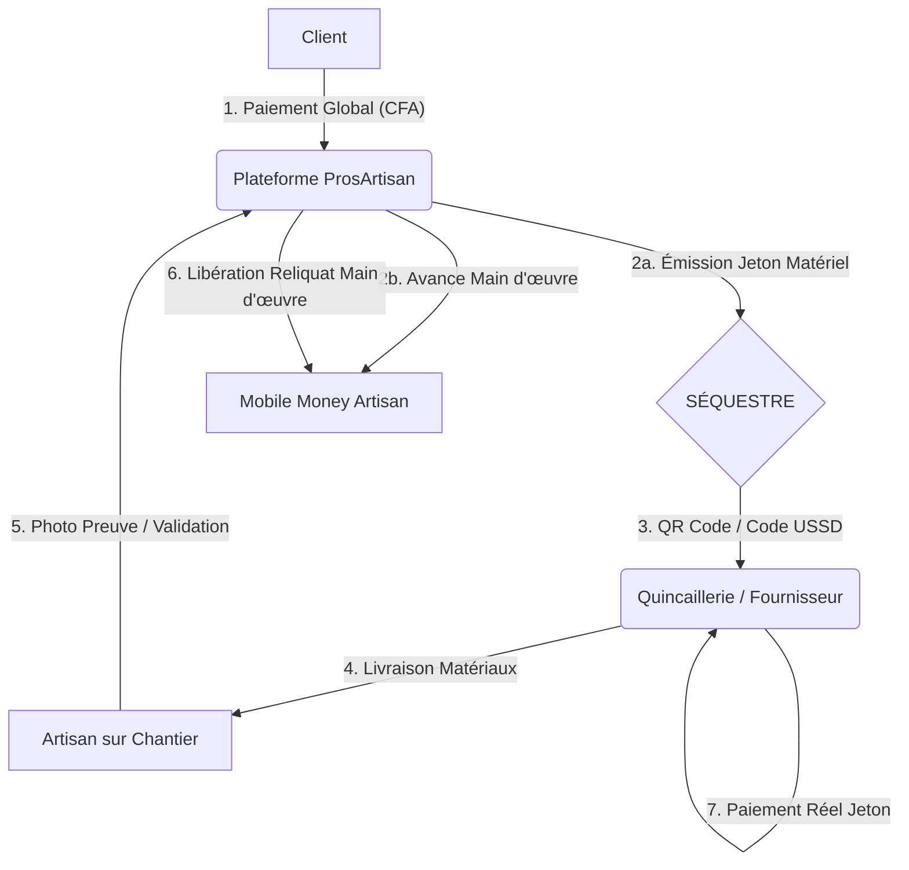

# CAHIER DES CHARGES : PLATEFORME PROSARTISAN (VERSION 1.0)

## 1. PRÉSENTATION DU PROJET

ProsArtisan est une plateforme de mise en relation sécurisée entre artisans qualifiés et clients en Côte d’Ivoire. Elle résout les problèmes de confiance, de sécurité et de visibilité grâce à un système innovant de séquestre financier et un indicateur de réputation nommé **Score N’Zassa**.

### 1.1 Objectifs de la Phase 1
- Développer l'application mobile (Android/iOS) et le back-office.
- Lancer le service sur 3 métiers pilotes : Plomberie, Électricité, Maçonnerie.
- Sécuriser les transactions via Mobile Money et Jetons Matériels.

## 2. ÉCOSYSTÈME ET UTILISATEURS

1. **Le Client** : Recherche, commande, paie l'acompte et valide la fin des travaux.
2. **L’Artisan** : Reçoit les missions, génère les besoins en matériel (Devis), exécute et perçoit sa main-d'œuvre.
3. **Le Fournisseur (Quincaillerie)** : Partenaire agréé qui échange les jetons numériques contre du matériel physique.
4. **Le Référent de Zone** : Tiers de confiance pour la validation physique des chantiers > 2 000 000 FCFA.

## 3. SPÉCIFICATIONS FONCTIONNELLES

### 3.1 Recherche et Cartographie (Expérience Maps)
- **Filtrage** : Recherche par catégorie et par zone (ex : "Maçon à Cocody").
- **Affichage Dynamique** : Utilisation de l'API Google Maps (ou autres) avec Clustering (regroupement des marqueurs en zone dense).
- **Priorité de Proximité** :
  - Les artisans dans un rayon ≤ 2 km du client sont mis en évidence (marqueurs dorés).
  - Ces artisans les mieux notés apparaissent systématiquement en tête de liste de recherche.
- **Confidentialité** : La position exacte de l'artisan est "floutée" dans un rayon de 50 m tant que le devis n'est pas accepté.

### 3.2 Système de Séquestre et "Jeton Matériel"
- **Paiement Sécurisé** : Le paiement du client est bloqué sur la plateforme (Séquestre).
- **Fragmentation automatique** :
  - Portefeuille A : Matériel (bloqué pour le fournisseur).
  - Portefeuille B : Main-d’œuvre (libéré par tranches à l'artisan).
- **Validation du Jeton (Anti-Fraude)** :
  - Le jeton matériel ne peut être validé par le fournisseur que si les coordonnées GPS de l'artisan et du fournisseur coïncident (distance < 100 m). *Option à paramétrer*
  - Preuve visuelle : L'artisan doit uploader une photo géolocalisée du matériel sur le site du chantier pour débloquer la suite du flux.

### 3.3 Le Score N’Zassa (Réputation & Solvabilité)

Calculé sur 100 points, ce score prépare l'artisan à l'accès au crédit (Phase 2).

- **Fiabilité (40 %)** : Ratio chantiers acceptés / chantiers terminés.
- **Intégrité (30 %)** : Absence de tentatives de paiement direct (hors App).
- **Qualité (20 %)** : Moyenne des notes clients.
- **Réactivité (10 %)** : Temps de réponse moyen aux demandes.
- **Log** : Toutes les variations du score sont historisées pour audit bancaire.

## 4. SPÉCIFICATIONS TECHNIQUES

### 4.1 Stack Technologique
- **Mobile** : Flutter (iOS & Android).
- **Backend** : Python (FastAPI) pour la gestion rapide des transactions et du scoring.
- **Base de données** : PostgreSQL (avec extension PostGIS pour la géolocalisation).
- **Communications** : Firebase Cloud Messaging (Push) + API WhatsApp Business (Notifications critiques).

### 4.2 Résilience et Connectivité
- **Mode Offline** : En cas de faible réseau, l'application doit permettre la validation par OTP SMS (code reçu par SMS et saisi par le fournisseur).
- **Synchronisation** : Les données locales sont poussées au serveur dès le retour d'une connexion internet.

## 5. GOUVERNANCE ET SÉCURITÉ
- **KYC (Know Your Customer)** : Inscription artisan soumise à vérification (CNI/Passeport + Selfie).
- **Matrice des Sanctions** :
  - Tentative de contournement du système (cash direct) : Suspension immédiate du compte.
  - Collusion de fraude sur matériel : Radiation définitive de l'artisan et du fournisseur.

## 6. USER STORIES

### 1. Épic : Gestion du Séquestre & Paiement Client
**Objectif** : Sécuriser les fonds du client et fragmenter l'acompte.

- **US #101 : Dépôt de garantie via Mobile Money**  
  En tant que Client,  
  Je veux payer l'acompte de mon devis via Wave ou Orange Money sur l'application,  
  Afin que mon argent soit sécurisé en séquestre et non remis directement en cash à l'artisan.  

  **Critères d'acceptation** :
  - Génération d'un lien de paiement sécurisé.
  - Notification SMS immédiate de confirmation de dépôt.
  - Statut du projet passe à "Financé".

- **US #102 : Fragmentation automatique des fonds**  
  En tant que Système,  
  Je veux diviser l'acompte reçu selon les ratios définis (ex : 65 % Matériel / 35 % Main-d'œuvre),  
  Afin de préparer l'émission du Jeton Matériel et le premier jalon de cash.  

  **Critères d'acceptation** :
  - Calcul automatique basé sur les lignes du devis.
  - Isolation des sommes dans des portefeuilles (wallets) virtuels distincts.

### 2. Épic : Le Jeton Matériel (Côté Artisan & Quincaillier)
**Objectif** : Transformer le crédit en ressources tangibles sans manipulation de cash.

- **US #201 : Génération du Jeton Matériel**  
  En tant qu'Artisan,  
  Je veux générer un code de Jeton Matériel sur mon application ou par USSD,  
  Afin de pouvoir récupérer les fournitures chez le quincaillier sans payer de ma poche.  

  **Critères d'acceptation** :
  - Code alphanumérique court (ex : PA-4592).
  - Affichage du montant disponible et de la liste des quincailleries partenaires proches.

- **US #202 : Validation et Scan par le Quincaillier**  
  En tant que Quincaillier,  
  Je veux scanner le QR Code ou saisir le code USSD présenté par l'artisan,  
  Afin de valider la vente et être payé par la plateforme.  

  **Critères d'acceptation** :
  - Vérification en temps réel de la validité du code.
  - Possibilité de validation partielle (ex : j'utilise 50k sur un jeton de 100k).
  - Déclenchement du virement vers le compte du quincaillier (J+1).

### 3. Épic : Suivi de Chantier & Libération de la Main-d'œuvre
**Objectif** : Lier le paiement au travail réellement effectué.

- **US #301 : Preuve de livraison sur site**  
  En tant qu'Artisan,  
  Je veux prendre une photo du matériel arrivé sur le chantier et l'uploader,  
  Afin de prouver au client que le projet avance.  

  **Critères d'acceptation** :
  - Photo horodatée et géolocalisée.
  - Envoi automatique de la photo au client via l'App ou WhatsApp.

- **US #302 : Libération du jalon Main-d'œuvre**  
  En tant que Client,  
  Je veux valider une étape de travaux sur mon téléphone,  
  Afin de libérer la part de "cash" correspondant à la rémunération de l'artisan.  

  **Critères d'acceptation** :
  - Validation par code OTP reçu par SMS.
  - Transfert instantané des fonds vers le Mobile Money de l'artisan.

### 4. Épic : Scoring & Profil "N'Zassa"
**Objectif** : Valoriser l'historique de l'artisan pour le crédit bancaire.

- **US #401 : Consultation du Score de Fiabilité**  
  En tant qu'Artisan,  
  Je veux voir l'évolution de mon score (Palmier de Crédit) après chaque chantier,  
  Afin de savoir quand je serai éligible à un prêt pour de nouveaux outils.  

  **Critères d'acceptation** :
  - Graphique simple montrant les points gagnés (ponctualité, honnêteté).
  - Conseils personnalisés pour améliorer son score.

- **US #402 : Demande de micro-crédit d'urgence**  
  En tant qu'Artisan avec un score > 700,  
  Je veux solliciter une avance "Urgence Sociale" sans impacter le budget du chantier,  
  Afin de régler un problème familial sans arrêter les travaux.  

  **Critères d'acceptation** :
  - Vérification automatique de l'éligibilité.
  - Déblocage sous 2h maximum.

### 5. Épic : Sécurité & Gouvernance
**Objectif** : Prévenir la collusion et les erreurs.

- **US #501 : Alerte de proximité (Anti-Fraude)**  
  En tant que Système,  
  Je veux comparer la position GPS de l'Artisan et du Quincaillier lors de la transaction,  
  Afin d’empêcher la validation de jetons à distance (fausses factures).  

  **Critères d'acceptation** :
  - Blocage si l'écart est > 100 mètres. À paramétrer.
  - Notification à l'administrateur en cas de tentative suspecte.

## 7. SPÉCIFICATIONS DU BACK-OFFICE (ADMINISTRATION & MODÉRATION)

Le back-office est une interface web responsive destinée aux gestionnaires de la plateforme ProsArtisan. Il est divisé en cinq grands modules de pilotage.

### 1. Module de Gestion du KYC et des Utilisateurs
- Validation des profils : Interface de vérification des pièces d'identité (CNI/Attestations) et des selfies (Liveness check).
- Gestion des statuts : Possibilité d'activer, suspendre ou radier un utilisateur (Client, Artisan ou Fournisseur).
- Annuaire des Référents : Cartographie et gestion des "Référents de Zone" avec suivi de leurs zones d'intervention et commissions perçues.

### 2. Tour de Contrôle du Séquestre Financier
- Monitoring des transactions : Vue en temps réel des dépôts Mobile Money (Wave, Orange, MTN).
- Statut des Jetons Matériels : Liste des jetons générés, en attente de validation ou expirés.
- Déblocage manuel : En cas de bug technique ou de force majeure, l'administrateur peut forcer la validation d'une étape après vérification téléphonique.
- Gestion des Commissions : Paramétrage des taux de prélèvement de la plateforme (ex : 10 % sur la main-d'œuvre). À paramétrer selon la catégorie d’artisan.

### 3. Centre de Gestion des Litiges et Médiation
- Interface de Médiation : Accès aux logs de discussion (Chat) entre le client et l'artisan.
- Visualisation des preuves : Consultation des photos géolocalisées déposées par l'artisan à chaque étape du chantier.
- Arbitrage financier : Boutons d'action pour :
  - Rembourser le client (partiellement ou totalement).
  - Payer l'artisan malgré une contestation abusive du client.
  - Geler les fonds en attendant une visite du Référent de Zone.

### 4. Pilotage de la Performance (Score N'Zassa)
- Paramétrage des poids : Modifier l'importance de la ponctualité par rapport à la qualité des travaux dans le calcul du score.
- Audit de solvabilité : Génération de rapports PDF par artisan, destinés à être transmis aux microfinances partenaires (historique des chantiers, revenus générés, score de fiabilité).
- Alertes Fraude : Système de détection automatique des comportements suspects (ex : un artisan et un fournisseur qui valident 5 jetons en 10 minutes).

### 5. Gestion du Catalogue et des Zones
- Indice des Prix : Mise à jour trimestrielle des prix moyens des matériaux par zone pour détecter les surfacturations lors de la génération des devis.
- Gestion des Catégories : Ajout de nouveaux métiers (ex : Peinture, Menuiserie) au fur et à mesure de l'expansion.
- Heatmap (Carte de chaleur) : Visualisation des zones à forte demande pour encourager les artisans à se déplacer vers ces quartiers (ex : forte demande de plombiers à Bingerville).

**Spécifications Techniques du Back-office** :
- Accès : Authentification à deux facteurs (2FA) obligatoire pour tous les administrateurs.
- Journalisation (Logs) : Chaque action effectuée par un administrateur doit être tracée (Qui ? Quoi ? Quand ?).
- Techno recommandée : React.js ou Vue.js connecté à l'API Python (FastAPI).

## 6. Diagramme de Flux Global (Écosystème)

## 7. Détail Technique des Interactions

### A. Le Flux "Jeton Matériel" (Logistique & Sécurité)
1. **Génération** : Une fois le devis validé, la plateforme génère un identifiant unique (Hash ou code court).
2. **Séquestre Partiel** : Si le projet coûte 1 000 000 FCFA (700k matériel / 300k main-d'œuvre), la plateforme bloque les 700k dans un sous-compte dédié au fournisseur.
3. **Consommation** : L'artisan se rend à la quincaillerie. Le commerçant scanne le code via une interface web simple ou saisit un code USSD.
4. **Confirmation** : Le fournisseur reçoit une notification : "Paiement de 700k garanti par ProsArtisan. Vous pouvez libérer le ciment et le fer."

### B. Le Flux "Validation Sociale" (Preuve par l'acte)
- Étape de l’Artisan : Dès réception du matériel, l'artisan prend une photo (via l’App ou WhatsApp Business API liée à la plateforme).
- Alerte Client : Le client reçoit une notification : "Vos matériaux sont arrivés sur site".
- Déblocage Main-d'œuvre : Ce signal déclenche automatiquement le versement d'une portion du séquestre main-d'œuvre (ex : 15 %) sur le compte Wave/Orange Money de l'artisan pour payer ses manœuvres du jour.

## 8. Architecture du Séquestre (Modèle de Données)

| Entité            | Attributs Clés                          | Fonction                                           |
|-------------------|-----------------------------------------|----------------------------------------------------|
| Escrow_Wallet     | ID_Projet, Total_Amount, Status         | Stocke les fonds du client en attente.             |
| Material_Token    | Token_Code, Vendor_ID, Value, Is_Redeemed | Le "bon d'achat" numérique infalsifiable.         |
| Milestone_Trigger | Step_Name, Photo_URL, Validation_Date    | Les jalons qui libèrent le cash main-d'œuvre.      |
| Social_Score      | Artisan_ID, Completion_Rate, Delay_Avg  | Score de réputation basé sur le respect du séquestre. |

## 9. Spécifications du "Jeton Matériel" (Le Smart Logic)
- **Péremption** : Le jeton expire si non utilisé sous 7 jours (retour des fonds au client ou relance).
- **Géolocalisation** : Le jeton ne peut être validé que par un fournisseur situé dans la zone géographique du chantier (prévention de la revente).
- **Traçabilité des prix** : Le système compare le prix du sac de ciment saisi par le quincaillier avec le prix moyen du marché ivoirien pour détecter les surfacturations.

## 10. Intégration dans l’environnement local
1. **Partenariat Quincailliers** : Le système doit prévoir une commission de 1 à 2 % pour le quincaillier pour l'inciter à utiliser la plateforme plutôt que le cash.
2. **Gestion du "Hors-Forfait"** : Prévoir un mode dégradé où le client peut valider manuellement le séquestre par un simple SMS OUI au numéro court de la plateforme si l'artisan n'a pas de connexion internet.

---

## FICHE D’INTERVENTION & DE RÉCEPTION - PROSARTISAN

**N° de Mission** : [ID-MISSION-000] | **Date** : jj/mm/aaaa

### 1. INFORMATIONS GÉNÉRALES
- **Artisan** : [Nom du Professionnel]
- **Client** : [Nom du Client]
- **Localisation** : [Quartier / Commune]
- **Heure d'arrivée** : ________ | **Heure de départ** : ________

### 2. DÉTAILS DE L'INTERVENTION
**Description des travaux réalisés** :  
(Ex : Réparation fuite évier, installation de 2 climatiseurs, changement de tableau électrique)

### 3. GESTION DES MATÉRIAUX (Le cas échéant)

| Désignation du matériel | Quantité | Prix Unitaire | Total |
|-------------------------|----------|---------------|-------|
|                         |          |               |       |
|                         |          |               |       |
|                         |          |               |       |
|                         |          |               |       |

**Total Matériaux** : ________________ CFA

- [ ] Factures originales jointes / remises au client (Obligatoire selon contrat)

### 4. CONTRÔLE DE CONFORMITÉ (Check-list)
- [ ] Le travail est terminé conformément à la demande initiale.
- [ ] Le matériel installé a été testé devant le client et fonctionne.
- [ ] Les lieux ont été nettoyés après l'intervention.
- [ ] L'artisan a prodigué des conseils d'entretien au client.

**Observations / Réserves éventuelles** :  
(Si une petite finition reste à faire ou si le client doit acheter une pièce supplémentaire)

### 5. RÉCAPITULATIF FINANCIER
1. **Main-d’œuvre (Service)** : ________________ CFA
2. **Total Matériaux** : ________________ CFA
3. **TOTAL À PAYER** : ________________ CFA

**Mode de règlement** : [ ] Mobile Money | [ ] Espèces (si autorisé)

### 6. VALIDATION ET SIGNATURES

Le client reconnaît par la présente que les travaux ont été réalisés de manière satisfaisante et que les lieux ont été rendus propres. La signature de cette fiche déclenche la clôture de la mission sur la plateforme ProsArtisan.

**Signature de l'Artisan**       **Signature du Client**

### Mes conseils pour l’utilisation de cette fiche :
- **Version Digitale** : Fiche peut être un simple formulaire à remplir. Le client "signe" avec son doigt sur l'écran ou valide via un code OTP reçu par SMS (très sécurisé pour confirmer la fin des travaux).
- **La photo "Preuve"** : Prendre une photo du chantier terminé et de la fiche signée, puis les envoyer sur le WhatsApp de support de ProsArtisan.
- **Droit de réserve** : Si le client a une réserve (ex : "ça fuit encore un peu"), l'artisan ne doit pas faire signer la fiche avant d'avoir réglé le point, ou doit noter la réserve clairement pour que vous puissiez faire le suivi.