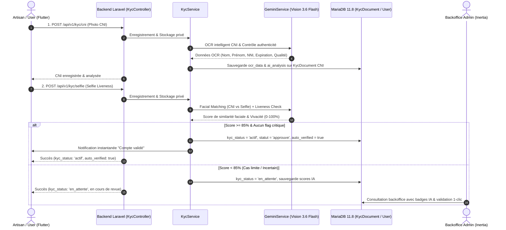

# Plan — Chantier 5 : KYC automatisé avec Gemini Vision

| Champ | Valeur |
| --- | --- |
| Statut | livré |
| Créé le | 2026-09-25 |
| Mis à jour le | 2026-09-25 |
| Auteur | Plan rédigé dans l'IDE Antigravity ; réalisation Claude Code |
| Source d'origine | `~/.gemini/antigravity-ide/brain/be573a45-7416-419e-8488-549bf8b5424d/plan_chantier_5_kyc_gemini.md` |
| Analyses liées | `docs/produit/analyse-backlog.md` (Epic 7 : « pas de Liveness detection IA ») |
| Audits | `../audits/2026-09-25-audit-chantier-5-kyc-gemini.md` |
| Commits | `25a97550` (étapes 1 à 4 et 7), étapes 5–6 et correctif `KycController` : commit suivant |

> Texte du plan reproduit tel qu'il a été rédigé ; les écarts de la réalisation sont consignés à la fin.

## 🎯 Objectif
Permettre l'enrôlement et l'activation des artisans, livreurs, clients et fournisseurs en **moins de 2 minutes** grâce à l'analyse biométrique et documentaire multimodale de **Gemini 3.6 Flash** :
1. **OCR intelligent du document d'identité** (CNI ivoirienne, Passeport, Attestation) : extraction structurée du nom, prénoms, numéro NNI, date de naissance, expiration, et contrôle d'authenticité/lisibilité.
2. **Comparaison biométrique faciale & Liveness** : comparaison du visage extrait de la CNI avec le selfie en direct de l'utilisateur, vérification de vivacité (anti-spoofing).
3. **Auto-approbation instantanée** : si le score de confiance global $\ge 85\%$ et aucune anomalie critique n'est détectée, le compte est validé immédiatement (`kyc_status = actif`) sans attendre l'intervention d'un administrateur.
4. **Assistance à la décision dans le backoffice** : pour les cas limites (score entre 50% et 84%), les données extraites et les scores IA sont affichés dans le backoffice pour permettre une revue humaine en un clic.

---

## 🏗️ Architecture & Composants

---

## 📑 Étapes d'Implémentation

### Étape 1 : Schéma BDD & Migrations MariaDB
- Migration `add_ai_verification_fields_to_kyc_documents_table` :
  - `ocr_data` (`json`, nullable) : Données extraites (nom, prénom, NNI, type document, dates).
  - `ai_confidence_score` (`unsignedTinyInteger`, nullable) : Score global 0 à 100.
  - `ai_analysis` (`json`, nullable) : Rapport détaillé (anomalies, qualité image, concordance visuelle).
  - `auto_verified` (`boolean`, default false) : Indicateur d'approbation automatique par IA.
  - `face_matched` (`boolean`, default false) : Validation du rapprochement facial.
- Mise à jour du modèle Eloquent `KycDocument` (casts, attributs fillable).

### Étape 2 : Moteur IA Gemini Vision dans `GeminiService.php`
- `extractCniData(string $cniPathOrBase64, string $mimeType, ?int $userId = null): array` :
  - Extraction structurée JSON des champs de la pièce d'identité.
  - Vérification de netteté, détection d'écran/photocopie altérée.
- `verifyFaceAndLiveness(string $cniPath, string $selfiePath, ?int $userId = null): array` :
  - Comparaison faciale des 2 images en un seul appel multimodal.
  - Score de ressemblance faciale (0-100%).
  - Détection anti-usurpation / anti-spoofing (liveness score).
  - Fallback déterministe pour l'environnement de test (`app.env === 'testing'`).

### Étape 3 : Logique Métier dans `KycService.php`
- Méthode `processAiVerification(User $user): array` :
  - Récupère la CNI et le Selfie récents du disque privé.
  - Exécute les analyses Gemini Vision.
  - Applique les règles de décision (seuil à 85 %, aucune anomalie critique).
  - En cas de succès : validation automatique des documents et de l'utilisateur (`actif`).
  - Déclenche la notification appropriée (validé automatiquement vs en cours de vérification humaine).

### Étape 4 : Exposition API (`KycController.php` & Routes)
- Mise à jour des réponses de `uploadCni`, `uploadSelfie` et `status` pour inclure les statuts d'auto-approbation et les scores IA.
- Endpoint de relance facultatif `POST /api/v1/kyc/verify-ai` si l'utilisateur souhaite relancer l'analyse en cas d'échec initial.

### Étape 5 : Backoffice Admin Inertia (`KycPanel.tsx` & `AdminPanelData.php`)
- Affichage des badges IA sur chaque ligne du tableau KYC :
  - Badge vert `🤖 94% Auto-validé` ou badge ambre `🤖 72% Revue conseillée`.
- Affichage dans une infobulle ou modale des détails extraits par l'OCR (Nom CNI, N° de pièce, Concordance faciale) pour accélérer la revue humaine.

### Étape 6 : Application Mobile Flutter
- Mise à jour de `kyc_selfie_liveness_screen.dart` et `auth_controller.dart` :
  - Affichage d'un indicateur de vérification instantanée pendant l'upload du selfie.
  - Si `kyc_status == 'actif'` en retour, affichage d'un dialogue de félicitation et accès direct à la plateforme.

### Étape 7 : Tests & Validation
- Tests Feature backend Pest (`KycAiVerificationTest.php`) couvrant :
  - Extraction OCR valide et invalide.
  - Rapprochement facial positif (score $\ge 85\%$) $\rightarrow$ passage automatique à `actif`.
  - Rapprochement facial négatif ou document altéré $\rightarrow$ maintien en `en_attente`.
- Tests mobiles Flutter.
- Mise à jour de la documentation (`PRD.md`, `AGENTS.md`, `CLAUDE.md`).

---

## Écarts

Constatés à la livraison (détail dans l'audit lié) :

1. **Pas de résultat simulé en environnement de test (étape 2).** Le « fallback déterministe » prévu renvoyait aussi un faux résultat favorable quand la clé Gemini manquait, ce qui activait tout compte en production. Les analyses échouent désormais fermées (`analysis_available = false`) et les tests simulent Gemini par `Http::fake`.
2. **Fournisseurs exclus de l'auto-approbation (objectif).** Leur agrément suit déjà une revue humaine (CNMCI, quincaillerie) ; réglable via `prosartisan.kyc.auto_approval_roles`.
3. **Garde-fous ajoutés hors plan.** Comparaison faciale liée à la pièce courante (`ai_analysis.cni_document_id`), numéro de pièce unique entre comptes (`ocr_document_number`), aucun réveil d'un dossier rejeté/suspendu/anonymisé, date d'expiration revérifiée côté serveur, interrupteur `KYC_AUTO_APPROVAL_ENABLED`, limiteur `throttle:ai`.
4. **Badge « Auto-validé » dans la liste des utilisateurs (étape 5)** plutôt que dans la file KYC, que les dossiers auto-validés quittent aussitôt. La file affiche « IA favorable / Revue conseillée / Risque élevé » et les motifs de blocage.
5. **Étiquette « Vérifié » retirée de l'aperçu du selfie (étape 6)** : elle s'affichait avant toute réponse du serveur (Règle d'or 29).
